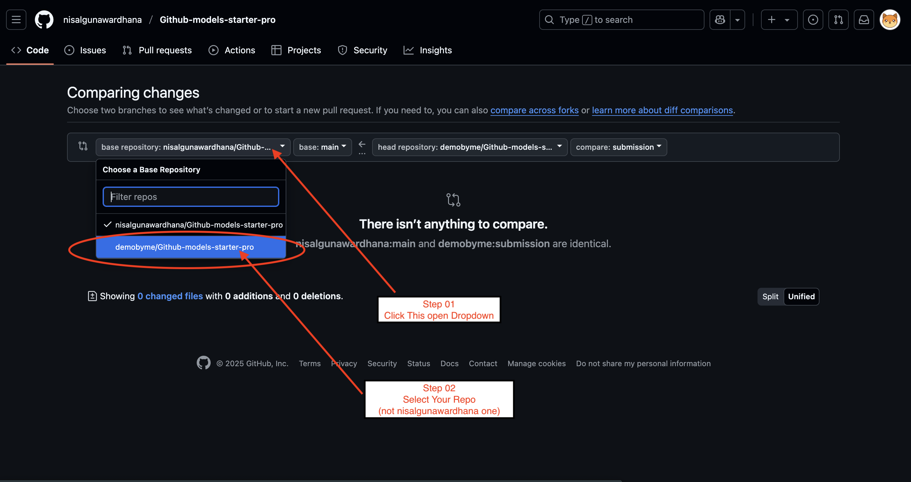
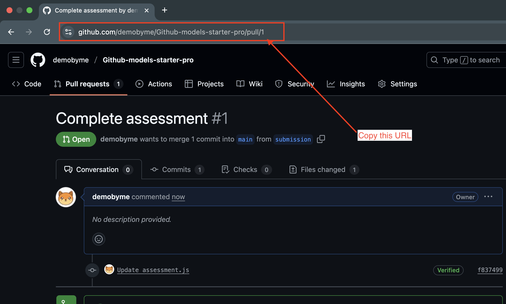

# LLM-Powered ACP Agent: Complete Guide (A-Z)

This repository contains an advanced Agent Communication Protocol (ACP) implementation that integrates with GitHub's AI model (OpenAI GPT-5) to provide intelligent responses. This guide will walk you through everything from setup to completion of the assignment.

## Table of Contents

- [Introduction to ACP](#introduction-to-acp)
- [Project Structure](#project-structure)
- [Prerequisites](#prerequisites)
- [Getting Started](#getting-started)
  - [Fork and Clone the Repository](#fork-and-clone-the-repository)
  - [Set Up Your Environment](#set-up-your-environment)
  - [Install Dependencies](#install-dependencies)
- [Understanding the Code](#understanding-the-code)
  - [ACP Server (llm_agent.py)](#acp-server-llm_agentpy)
  - [ACP Client (llm_client.py)](#acp-client-llm_clientpy)
- [Running the Sample Code](#running-the-sample-code)
- [Assignment: Creating a Knowledge Assistant](#assignment-creating-a-knowledge-assistant)
  - [Requirements](#requirements)
  - [Implementation Guide](#implementation-guide)
  - [Testing Your Implementation](#testing-your-implementation)
- [Submitting Your Assignment](#submitting-your-assignment)
  - [Pushing Changes to GitHub](#pushing-changes-to-github)
  - [Creating a Pull Request](#creating-a-pull-request)
  - [Creating a Submission Issue](#creating-a-submission-issue)
- [Troubleshooting](#troubleshooting)
- [Additional Resources](#additional-resources)
- [FAQ](#faq)

## Introduction to ACP

The Agent Communication Protocol (ACP) is a standardized way for AI agents to communicate with clients. It defines a clear interface for exchanging messages between AI systems and clients, supporting features like:

- Standardized request and response formats
- Streaming responses
- State management across interactions
- Flexibility for different agent types

ACP makes it easier to build, maintain, and integrate AI systems by providing a common communication framework.


## Project Structure

```
LLM-Powered-ACP-Agent/
├── llm_agent.py         # The ACP server implementation with GitHub AI integration
├── llm_client.py        # Sample client for testing the ACP server
├── README.md            # This documentation
└── .env.example         # Example environment variables file
```

## Prerequisites

Before you begin, ensure you have:

- GitHub account with access to GitHub AI models
- GitHub personal access token with appropriate permissions
- Python 3.8 or higher
- Git installed on your machine
- Basic knowledge of Python and async programming
- [uv](https://github.com/astral-sh/uv) Python package manager (or pip)

## Getting Started

### Fork and Clone the Repository

1. Fork this repository to your GitHub account by clicking the "Fork" button at the top right of the repository page.

2. Clone your forked repository to your local machine:

```bash
git clone https://github.com/nisalgunawardhana/LLM-Powered-ACP-Agent.git
cd LLM-Powered-ACP-Agent
```

3. Create a submission branch for your changes:

```bash
git checkout -b submission
```

### Set Up Your Environment

1. Create a `.env` file in the root directory based on the `.env.example` template:

```bash
cp .env.example .env  # If .env.example exists
# OR
touch .env            # If it doesn't exist
```

2. Add your GitHub token to the `.env` file:

```
GITHUB_TOKEN="your-github-token-goes-here"
```

Alternatively, you can set the token as an environment variable:

**Bash/Zsh:**
```bash
export GITHUB_TOKEN="your-github-token-goes-here"
```

**PowerShell:**
```powershell
$Env:GITHUB_TOKEN="your-github-token-goes-here"
```

**Windows Command Prompt:**
```cmd
set GITHUB_TOKEN=your-github-token-goes-here
```

### Install Dependencies

Initialize your project and install the required Python packages using uv:

```bash
# Initialize a new uv project with Python 3.11 or higher
uv init --python ">=3.11"
```
```bash
# Install the ACP SDK
uv add acp-sdk
```
```bash
# Install the Azure AI Inference SDK
uv add azure-ai-inference
```
```bash
# Install dotenv for environment variable management
uv add python-dotenv
```

If you prefer using pip instead of uv:

```bash
pip install acp-sdk azure-ai-inference python-dotenv
```

## Understanding the Code

### ACP Server (llm_agent.py)

The `llm_agent.py` file contains the ACP server implementation that:

1. Sets up communication with GitHub's AI model
2. Creates an ACP server with a single agent endpoint
3. Processes incoming messages and sends them to the AI model
4. Returns AI-generated responses back to the client
5. Maintains conversation history for context

Key components:
- `ChatCompletionsClient`: Connects to GitHub's AI API
- `Server`: The ACP server that handles incoming requests
- `@server.agent()`: Decorator that registers the `llm_assistant` function as an ACP agent
- `conversation_history`: Dictionary that stores conversation history by session ID

### ACP Client (llm_client.py)

The `llm_client.py` file provides a simple client implementation that:

1. Connects to the local ACP server
2. Sends sample questions to the `llm_assistant` agent
3. Displays the responses
4. Demonstrates maintaining conversation context with follow-up questions

## Running the Sample Code

1. Start the ACP server in one terminal:

```bash
uv run llm_agent.py
```

2. In another terminal, run the client to test the server:

```bash
uv run llm_client.py
```

3. You can also test with curl:

```bash
curl -X POST http://localhost:8000/runs \
  -H "Content-Type: application/json" \
  -d '{
        "agent_name": "llm_assistant",
        "input": [
          {
            "role": "user",
            "parts": [
              {
                "content": "Explain what ACP is in simple terms",
                "content_type": "text/plain"
              }
            ]
          }
        ]
      }'
```

## Assignment: Creating a Knowledge Assistant

### Requirements

Your task is to enhance the LLM agent to make it a specialized knowledge assistant by:

1. Modifying the `llm_agent.py` file to:
   - Update the system prompt to focus on a specific knowledge domain
   - Enhance conversation history management
   - Implement robust error handling for API failures

### Implementation Guide

#### 1. Update the System Prompt

Choose a specific knowledge domain (e.g., programming, science, history) and update the system prompt:

```python
# Find this line in llm_agent.py:
SystemMessage("You are a helpful assistant powered by GitHub AI.")

# Replace it with a specialized prompt, for example:
SystemMessage("""You are a specialized programming assistant with expertise in Python, JavaScript, and software development best practices. 
Focus on providing clear, accurate code examples and explanations for programming concepts.
When sharing code, always include comments explaining key parts.
Suggest best practices and common pitfalls to avoid.""")
```

#### 2. Enhance Conversation History

The current implementation already has basic conversation history, but you can improve it by:

- Adding timestamps to track conversation flow
- Limiting conversation history length to prevent token limits
- Adding a mechanism to clear or summarize long conversations

#### 3. Improve Error Handling

Enhance the error handling to provide more informative messages:

```python
except Exception as e:
    # Categorize and handle different types of errors
    error_message = "I'm sorry, but I encountered an issue."
    
    if "rate limit" in str(e).lower():
        error_message += " The API rate limit has been exceeded. Please try again in a few minutes."
    elif "timeout" in str(e).lower():
        error_message += " The request timed out. This might be due to high server load or network issues."
    elif "token" in str(e).lower():
        error_message += " There seems to be an authentication issue. Please check your GitHub token."
    else:
        error_message += f" Error details: {str(e)}"
```

### Testing Your Implementation

After making your changes:

1. Start the agent server:
```bash
uv run llm_agent.py
```

2. Test with the client:
```bash
uv run llm_client.py
```

Verify that:
- Your agent responds with domain-specific knowledge
- It remembers context from previous messages
- It handles errors gracefully with informative messages

## Submitting Your Assignment

### Pushing Changes to GitHub

1. After implementing and testing your changes, commit them to your submission branch:

```bash
git add llm_agent.py
git commit -m "Implement specialized knowledge assistant"
git push origin submission
```

### Creating a Pull Request

- Create a pull request from your `submission` branch to the `main` branch on the Your repository.

   
   

    Follow the above images for a visual guide on creating a pull request.

   **Tip:** After creating your pull request, copy the PR link from your browser's address bar. You will need this link when creating your submission issue in the next step.

   

> **Note:** The images above demonstrate how to select the correct branches and create a pull request. The repository name shown in the screenshots may differ from yours—just follow the same steps for your own repository.


### Creating a Submission Issue

1. Go to the original repository (the one you forked from)
2. Navigate to the "Issues" tab
3. Click "New issue"
4. Select the "Submission" template if available
5. Fill in the required information:
   - Your full name
   - The URL of your pull request
   - A summary of what you learned
   - Any challenges you faced
6. Submit the issue

## Troubleshooting

### Common Issues and Solutions

1. **GitHub Token Issues**
   - Ensure your token has the correct permissions
   - Check that the token is correctly set in your environment
   - Verify the token hasn't expired

2. **Installation Problems**
   - Make sure Python 3.8+ is installed: `python --version`
   - Try installing dependencies individually if batch install fails
   - Check for package conflicts: `uv list`

3. **Runtime Errors**
   - Ensure the server is running before starting the client
   - Check port availability (default is 8000)
   - Look for error messages in the server console


## How to Get a GitHub Token (Developer Key)

To use these demos, you need a GitHub personal access token with the `models:read` permission.

**Steps to create a token:**
1. Go to [GitHub Settings > Developer settings > Personal access tokens](https://github.com/settings/tokens)
2. Click **Generate new token** (classic or fine-grained)
3. Name your token and set an expiration date
4. Under **Select scopes**, check `models:read`
5. Click **Generate token** and copy it (you won't be able to view it again)

**Video Walkthrough:**  
[](https://drive.google.com/file/d/15yXeESfRivaoXj1350rcwQbAzLaQJfMK/view?usp=sharing)  
[Watch the video walkthrough on Google Drive.](https://drive.google.com/file/d/15yXeESfRivaoXj1350rcwQbAzLaQJfMK/view?usp=sharing)

Watch this short video for a step-by-step guide on generating your GitHub personal access token.

> **Keep your token secure and do not share it publicly.**

## Additional Resources

- [Agent Communication Protocol Documentation](https://github.com/microsoft/acp/)
- [Azure AI Inference SDK Documentation](https://learn.microsoft.com/en-us/python/api/overview/azure/ai-inference-readme)
- [GitHub AI Models Documentation](https://docs.github.com/en/rest/ai)
- [Async Python Programming Guide](https://docs.python.org/3/library/asyncio.html)

To dive deeper into ACP concepts, visit the [Agent Communication Protocol main repository](https://github.com/nisalgunawardhana/Agent-Communication-Protocol) for documentation, examples, and advanced usage.

## Connect with Me

Follow me on social media for more sessions, tech tips, and giveaways:

- [LinkedIn](https://www.linkedin.com/in/nisalgunawardhana/) — Professional updates and networking
- [Twitter (X)](https://x.com/thenisals) — Insights and announcements
- [Instagram](https://www.instagram.com/thenisals) — Behind-the-scenes and daily tips
- [GitHub](https://github.com/nisalgunawardhana) — Repositories and project updates
- [YouTube](https://www.youtube.com/channel/UCNP5-zR4mN6zkiJ9pVCM-1w) — Video tutorials and sessions

Feel free to connect and stay updated!

## FAQ

**Q: Do I need a paid GitHub account to use the AI models?**  
A: Yes, access to GitHub AI models typically requires a GitHub account with appropriate permissions, which may include paid plans.

**Q: How can I check my token usage?**  
A: You can check your GitHub token usage in your GitHub account settings under "Developer settings" > "Personal access tokens".

**Q: Can I deploy this agent to production?**  
A: This implementation is for educational purposes. For production use, you would need to add authentication, rate limiting, and other security measures.

**Q: How do I choose a knowledge domain?**  
A: Select a domain you're familiar with or interested in. Popular choices include programming, data science, cloud computing, or specific frameworks like React or TensorFlow.

**Q: What if I encounter API rate limits?**  
A: GitHub AI models have usage limits. If you hit a rate limit, wait before making more requests or optimize your prompt to use fewer tokens.
